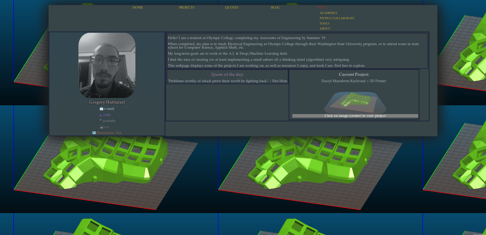

This is a website about myself and the activities I engage in.
Hand-coded HTML5/CSS.

Note: I'm working on a newer version available at [greghab.gitlab.io](http://greghab.gitlab.io). This versions adds the use of the Hakyll static site generator to add blog support + RSS feed generation, markdown support for writing webpages (& blog posts) in markdown, and code syntax highlighting using pandoc. It gets complicated, as the site has to be 're-compiled' each time I update, and so I have to incorporate CI into the pipeline. I'm using GitLab & GitLab CI to host and build the website, as there CI builds inside a docker, allowing me to import a docker which caches many of the Hakyll packages and reduce build times from > 1 hr (times-out) to < 5 min.

